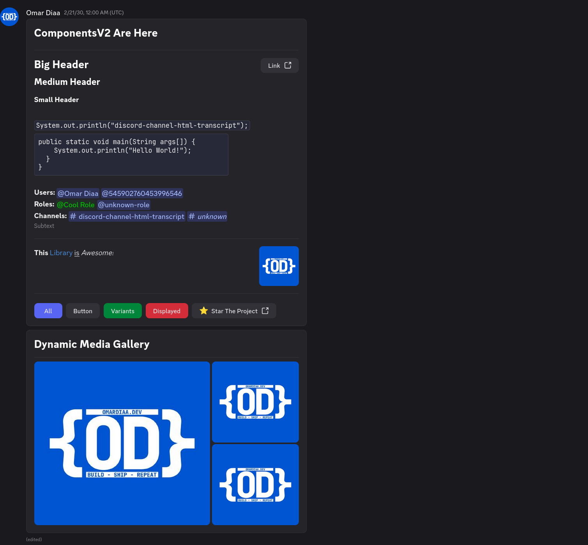
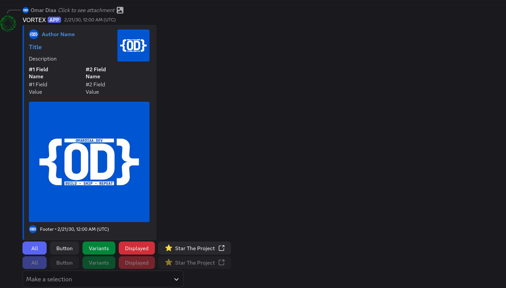

<h1 align="center">discord-channel-html-transcript</h1>

<p align="center"><strong>Discord Java library for generating HTML archives of channels, preserving the native Discord styles</strong></p>

<p align="center">
    <a href="https://central.sonatype.com/artifact/dev.omardiaa/discord-channel-html-transcript"></a>
    <a href="https://github.com/omardiaadev/discord-channel-html-transcript/blob/main/LICENSE"></a>
</p>

## About

This is the **most** up-to-date Transcript generator, ensuring your file is consistent with Discord's styles!\
Uses [**Java Discord API**](https://github.com/discord-jda/JDA)
& [**Java Template Engine**](https://github.com/casid/jte/).


<details>
    <summary>
        <strong>Contents</strong>
    </summary>
    <ul>
        <li><a href="#legal-compliance">Legal Compliance</a></li>
        <li><a href="#features">Features</a></li>
        <li><a href="#preview">Preview</a></li>
        <li><a href="#installation">Installation</a></li>
        <li><a href="#development">Development</a></li>
    </ul>
</details>

## Legal Compliance

> [!NOTE]
> This project utilizes the [gg sans](src/main/resources/font/ggsansvf-VF.woff) font that is the property of Discord Inc.

## Features

<ul>
    <li>
        <strong>ComponentsV2</strong>
        
    </li>
    <li><strong>Markdown</strong></li>
    <li><strong>Attachments</strong></li>
    <li><strong>Embeds</strong></li>
    <li><strong>Reactions</strong></li>
    <li><strong>Referenced Message</strong></li>
    <li><strong>Referenced Command</strong></li>
</ul>

<ul>
    <li><strong>To-Do:</strong></li>
    <ul>
        <li>Cleanup CSS</li>
        <li>Add List Markdown</li>
        <li>Format Normal Links</li>
    </ul>
</ul>

## Preview

<details>
    <summary><strong>Click To View</strong></summary>
    <ul>
        <li>
            <strong>ComponentsV2</strong>
            
        </li>
        <li>
            <strong>Embeds & Other Components</strong>
            
        </li>
        <li>
            <strong>Message</strong>
            
        </li>
        <li>
            <strong>Full Preview</strong>
            
        </li>
    </ul>
</details>

## Installation

##### Requirements

- **Java 21+**

##### Usage

```xml

<dependency>
  <groupId>dev.omardiaa</groupId>
  <artifactId>discord-channel-html-transcript</artifactId>
  <version>4.0.0</version>
</dependency>
```

```kts

implementation("dev.omardiaa:discord-channel-html-transcript:4.0.0")
```

## Development

1. Run [TranscriberTest#transcribe()](src/test/java/dev/omardiaa/transcript/TranscriberTest.java), an HTML file will appear in:
    - **Windows:** `%TEMP%\discord-channel-html-transcript\transcript.html`
    - **macOS:** `/tmp/discord-channel-html-transcript/transcript.html`
    - **Linux:** `/tmp/discord-channel-html-transcript/transcript.html`

2. Modify CSS in [style.css](src/test/resources/template/css/style.css) for live updates during development.

3. Copy CSS in [style.css](src/test/resources/template/css/style.css) to [style.jte](src/main/resources/templates/style.jte) when done.

## Enjoying My Work? Give it A Star!

<a href="https://fiverr.com/skywolfxp"></a>
<a href="https://reddit.com/user/omardiaadev"></a>
<a href="https://discord.gg/4j7h5q5rts"></a>
